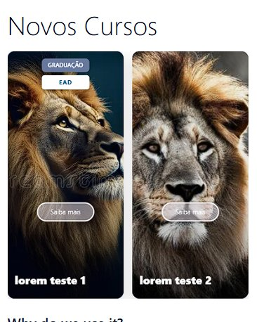
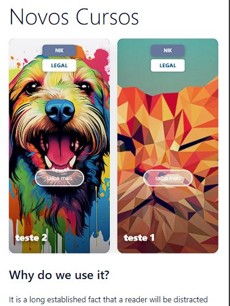
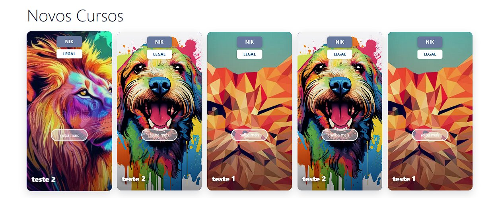
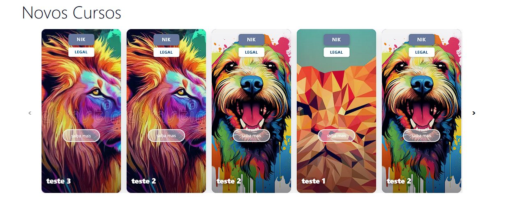
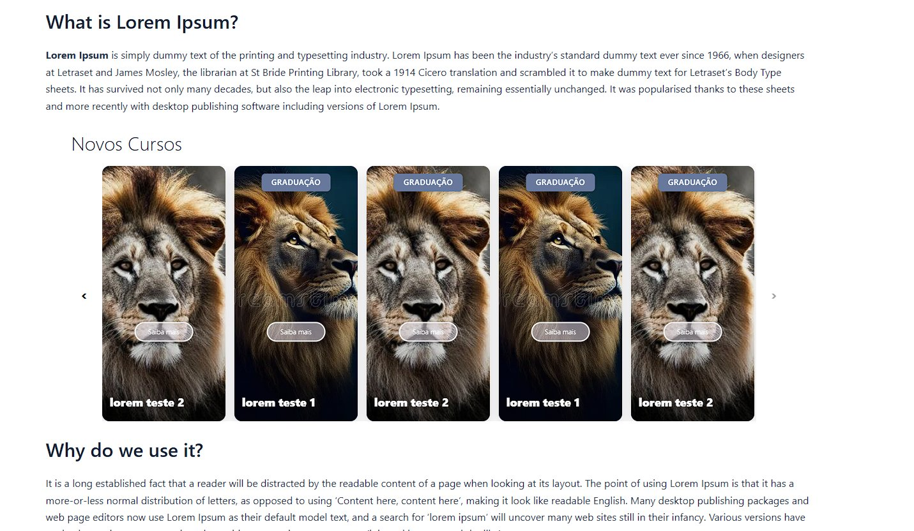

# Grid de Cursos (Carrossel) — WordPress Plugin


Plugin WordPress para exibir um **grid ou carrossel de cursos** totalmente configurável via painel admin — sem dependências externas, sem conflito com tema.

Desenvolvido por **Vausnicler Furin** — [vausnicler.dev](https://vausnicler.dev/)

---

## 📸 Screenshots

| Mobile — Grid fixo (≤ 4 cards) | Mobile — Carrossel (5+ cards) |
|:---:|:---:|
|  |  |

| Desktop — Grid estático (5 cards) | Desktop — Carrossel (6+ cards) |
|:---:|:---:|
|  |  |

**Painel Admin:**



---

## ✨ Funcionalidades

### 🎠 Grid & Carrossel — Comportamento responsivo inteligente

O plugin detecta automaticamente a quantidade de cards e o dispositivo para escolher o melhor layout:

| Quantidade de cards | Desktop | Mobile (≤ 768px) |
|---|---|---|
| 1 a 4 | Grid fixo | Grid fixo |
| 5 | Grid fixo | **Carrossel** |
| 6 ou mais | **Carrossel** | **Carrossel** |

- **Grid fixo** — distribui os cards em até 5 colunas no desktop, 3 no tablet e 2 no mobile, sem barra de rolagem
- **Carrossel** — slides com navegação por setas, swipe touch nativo e autoplay configurável
- **Responsividade automática** — 5 cards visíveis no desktop → 3 no tablet → 2 no mobile
- **Autoplay** — intervalo configurável via shortcode (`interval`); pausa automaticamente ao passar o mouse
- **Swipe touch** — gestos horizontais nativos no mobile, com detecção de scroll vertical para não interferir na rolagem da página
- **Setas de navegação** — ocultadas automaticamente no mobile; desabilitadas nos limites do carrossel
- **ResizeObserver** — reinicializa corretamente ao redimensionar a janela (ex: girar o celular)

---

### 🎨 Painel Admin — Cores

Todas as cores são configuradas visualmente com um color picker e preview ao vivo, sem precisar editar código.

**Badges de tipo de curso:**
- Graduação — cor de fundo e cor do texto
- Pós-Graduação — cor de fundo e cor do texto
- Profissionalizante — cor de fundo e cor do texto
- Técnico — cor de fundo e cor do texto

**Badges de modalidade:**
- EAD — cor de fundo e cor do texto
- EAD/Semipresencial — cor de fundo e cor do texto
- Presencial — cor de fundo e cor do texto

**Outros elementos:**
- Botão "Saiba mais" — cor do texto, cor da borda, cor de fundo e cor de fundo no hover
- Botão inferior da seção — cor de fundo e cor do texto
- Setas do carrossel — cor de fundo e cor do ícone
- Título do card — cor do texto
- Título da seção — cor do texto
- Fundo do card (fallback quando não há imagem) — gradiente com cor de topo e cor de base

---

### 📐 Painel Admin — Tipografia

- **Tamanho de fonte individual** (slider, em px) para cada elemento: badge tipo, badge modalidade, botão "Saiba mais", nome do curso, botão inferior e seta
- **Peso de fonte individual** (100 a 900) para cada elemento: título da seção, badge tipo, badge modalidade, botão "Saiba mais", nome do curso e botão inferior
- **Alinhamento horizontal independente** para: badge, nome do curso e botão inferior — opções: esquerda, centro ou direita
- **Posição vertical do botão "Saiba mais"** — ajuste em porcentagem, permitindo posicionar o botão em qualquer ponto do card

---

### 🔲 Painel Admin — Bordas & Espaçamento

- **Border-radius individual** (slider, 0–30px) para: badge tipo, badge modalidade, botão "Saiba mais", botão inferior e setas
- **Padding interno da seção** — controle separado de espaço interno acima e abaixo do bloco (0–200px)
- **Sombreado do card** — 4 pontos independentes de opacidade para controle fino do gradiente escuro sobreposto à imagem (permite destacar o texto sem esconder a imagem)

---

### ⚙️ Painel Admin — Comportamento

- **Efeito hover: escurecer** — ao passar o mouse sobre um card, os demais ficam levemente escurecidos, destacando o selecionado
- **Efeito hover: escalar (scale)** — o card cresce levemente ao receber foco do mouse (apenas desktop); configurável pelo admin
- **Exibir/ocultar botão inferior** — botão "Explorar outras graduações" (ou texto personalizado) com URL configurável; pode ser desativado
- **Exibir/ocultar botão "Saiba mais"** — o botão sobreposto ao card pode ser desativado globalmente
- **Título da seção** — texto exibido acima do grid/carrossel; campo em branco oculta o título

---

### 📰 Posts Automáticos (WP_Query)

Modo alternativo ao cadastro manual: o plugin busca posts diretamente do banco de dados.

- **Post type** — qualquer post type público registrado no WordPress (posts, pages, CPTs)
- **Filtro por taxonomia** — filtra por tag, categoria ou qualquer taxonomia; campo livre
- **Quantidade** — número de posts a exibir (1–50)
- **Badge padrão** — define o tipo de badge aplicado a todos os posts automáticos (Graduação, Pós, etc.)
- **Modalidade padrão** — define a modalidade aplicada a todos os posts (EAD, Presencial, etc.)
- **Texto do botão** — texto padrão para o botão "Saiba mais" nos posts automáticos
- **Badge personalizado** — permite digitar um texto livre como badge, independente das opções pré-definidas
- **Modalidade personalizada** — idem para o badge de modalidade
- A imagem usada é o **thumbnail (imagem destacada)** do post; o link do card aponta para o permalink do post

---

### 🃏 Cadastro Manual de Cursos

Para quem não usa posts do WordPress, os cursos podem ser cadastrados manualmente no admin:

- **Nome do curso** — exibido no rodapé do card
- **URL** — destino ao clicar no card (o card inteiro é clicável)
- **URL da imagem** — imagem de fundo do card; se ausente, exibe o gradiente fallback
- **Badge de tipo** — seleciona entre: nenhum, Graduação, Pós-Graduação, Profissionalizante, Técnico ou personalizado
- **Modalidade** — seleciona entre: nenhuma, EAD, EAD/Semipresencial, Presencial
- **Texto do botão** — texto personalizado para o botão "Saiba mais" daquele card
- Linha arrastável para reordenar os cursos com drag-and-drop no admin
- Botão para adicionar ou remover linhas dinamicamente

---

### 🔒 Isolamento total de CSS — compatível com qualquer tema

Este é um diferencial técnico importante: **o plugin não tem nenhuma dependência de CSS externo e não vaza estilos para o tema.**

- Todo o CSS é gerado inline, diretamente no HTML do shortcode, escopado por um **ID único por instância** (ex: `#gdc3a1b2c4d`), gerado via `md5(uniqid())`
- Isso significa que nenhuma regra do plugin afeta elementos fora do bloco, e nenhuma regra do tema sobrescreve o layout interno
- Compatível com Elementor, Divi, Avada, Astra, GeneratePress, Kadence, OceanWP, Hello e qualquer outro tema ou page builder
- Não carrega nenhuma folha de estilo externa (`.css`), nenhum script externo (`.js`) e não tem dependência de jQuery, Bootstrap, Swiper, Slick ou qualquer outra biblioteca
- O JavaScript é vanilla ES5, embutido diretamente no output do shortcode, escopado por closure `(function(){...})()`

---

## 🚀 Instalação

1. Faça o download do arquivo `.zip`
2. No painel do WordPress: **Plugins → Adicionar novo → Enviar plugin**
3. Selecione o `.zip` e clique em **Instalar agora**
4. Ative o plugin
5. Acesse **Grid de Cursos** no menu lateral do admin

---

## 📋 Uso

### Shortcode básico
```
[grid_cursos]
```

### Parâmetros disponíveis

| Parâmetro | Padrão | Descrição |
|---|---|---|
| `count` | 20 | Número máximo de cursos exibidos |
| `interval` | 5000 | Intervalo do autoplay em milissegundos (0 = desligado) |

### Exemplos
```
[grid_cursos]
[grid_cursos count="6"]
[grid_cursos interval="0"]
[grid_cursos count="10" interval="3000"]
```

O shortcode pode ser usado em qualquer página, post, widget de texto, template de tema ou page builder que suporte shortcodes WordPress padrão.

---

## 🏗️ Arquitetura técnica

| Item | Detalhe |
|---|---|
| **Linguagem** | PHP 7.4+, JavaScript ES5 vanilla, CSS3 |
| **Dependências** | **Nenhuma** — zero jQuery, zero bibliotecas externas |
| **CSS** | 100% gerado inline, escopado por ID único por instância |
| **JavaScript** | Gerado inline, closure isolada por instância |
| **Admin** | WordPress Settings API nativa |
| **Carrossel** | ResizeObserver + touch events nativos (sem Swiper, Slick, etc.) |
| **Banco de dados** | Apenas `wp_options` — sem tabelas customizadas |
| **Compatibilidade** | WordPress 5.0+, PHP 7.4+, todos os navegadores modernos |

---

## 📁 Estrutura do projeto

```
grid-de-cursos-carrossel/
├── grid-de-cursos-carrossel.php   ← plugin completo (arquivo único)
├── README.md
├── CHANGELOG.md
└── LICENSE
```

O plugin é **arquivo único** — toda a lógica PHP, o CSS gerado e o JavaScript estão em `grid-de-cursos-carrossel.php`. Isso facilita manutenção, auditoria e instalação.

---

## 🔧 Opções salvas no banco (wp_options)

| Option key | Descrição |
|---|---|
| `gdc_courses` | Array com os cursos cadastrados manualmente |
| `gdc_colors` | Todas as cores configuradas no admin |
| `gdc_fonts` | Tamanhos de fonte por elemento |
| `gdc_weights` | Pesos de fonte por elemento |
| `gdc_align` | Alinhamentos por elemento |
| `gdc_overlay` | 4 pontos de opacidade do sombreado |
| `gdc_padding` | Padding topo e base da seção |
| `gdc_titulo` | Título da seção |
| `gdc_more_url` | URL do botão inferior |
| `gdc_more_text` | Texto do botão inferior |
| `gdc_show_btn` | Exibir/ocultar botão inferior |
| `gdc_hover_escurecer` | Ativar efeito hover escurecer |
| `gdc_hover_scale` | Ativar efeito hover scale |
| `gdc_font_size` | Tamanho de fonte base |
| `gdc_saiba_bg_alpha` | Opacidade do fundo do botão "Saiba mais" |
| `gdc_saiba_radius` | Border-radius do botão "Saiba mais" |
| `gdc_btn_radius` | Border-radius do botão inferior |
| `gdc_badge_radius` | Border-radius dos badges |
| `gdc_badgemod_radius` | Border-radius do badge de modalidade |
| `gdc_arrow_radius` | Border-radius das setas |
| `gdc_auto_posts` | Ativar modo posts automáticos |
| `gdc_auto_post_type` | Post type para busca automática |
| `gdc_auto_tag` | Filtro de taxonomia para posts automáticos |
| `gdc_auto_count` | Quantidade de posts automáticos |
| `gdc_auto_badge` | Badge padrão para posts automáticos |
| `gdc_auto_modalidade` | Modalidade padrão para posts automáticos |
| `gdc_auto_saiba` | Texto do botão "Saiba mais" para posts automáticos |
| `gdc_auto_badge_custom` | Badge personalizado para posts automáticos |
| `gdc_auto_modal_custom` | Modalidade personalizada para posts automáticos |

---

## 📄 Changelog

Veja [CHANGELOG.md](CHANGELOG.md) para o histórico completo de versões.

---

## 👨‍💻 Autor

**Vausnicler Furin**

- 🌐 Site: [vausnicler.dev](https://vausnicler.dev/)
- 💼 LinkedIn: [linkedin.com/in/vausniclerfurin](https://www.linkedin.com/in/vausniclerfurin/)
- 🐙 GitHub: [github.com/vausnicler](https://github.com/vausnicler)
- 📧 Email: vausnicler@hotmail.com

---

## 📄 Licença

GPL-2.0 — veja [LICENSE](LICENSE) para detalhes.
